# RFC: Crewmate dynamic dashboard -- a project report beside every crewmate's chat

- Status: in-progress. This document ships INSIDE its implementing pull
  request: the repository takes no standalone RFC pull requests, so `doc-pr` is
  null and the implementation is the one named in `implementation-prs`. The
  First Principles lane reads an RFC's status off the **base** branch, so until
  this document is on main it reads as absent to that lane; clearing the lane is
  a maintainer's call (an override on the final head, or merging this document
  first), not this pull request's.
- Author: written up by the crew that implements it.
- Created: 2026-10-03
- Related:
  [`../system-specs/modules/dashboard-instances.md`](../system-specs/modules/dashboard-instances.md)
  (the shipped contract for templates, instances, versions and snapshots),
  [`../reference/crew-log/fold-paths.md`](../reference/crew-log/fold-paths.md)
  (every value a session fold renders),
  [rfc-append-only-ledger.md](rfc-append-only-ledger.md) (the crew log the page
  reads), [rfc-conductor-work-ledger.md](rfc-conductor-work-ledger.md) (the
  boards and work items the report rolls up),
  [rfc-composable-layout-mechanism.md](rfc-composable-layout-mechanism.md) (the
  sibling design for assigning a view to a surface).

## Summary

A crewmate's work lives in its chat. To learn what it did, what it spent and
what it needs from you, you scroll the transcript. This design puts that answer
on one page in the side panel, next to the chat:

- **what the crewmate is doing**: every workstream it runs, and every task
  inside each one
- **what it cost**: credits per task, per workstream, per hour
- **what came out**: accepted, rejected, still in flight
- **what it needs from you**: blocked tasks, open questions, and the lines the
  crewmate itself wants you to act on

The page is a template the crewmate adopts, filled from the crew log. The
crewmate can also write its own values into it, and those are marked as its own.

This change carries everything a page needs and no page: the folds, the template
format, the frame, the owner-only read route, the agentic write path and the tab
that mounts a page in the side panel. The built-in pages and their renders arrive
in the change stacked on it, which is where the sections marked below live. Until
then a crewmate that adopted nothing is served the frame's own empty state.

## Motivation

Three things a reader wants about a crewmate are each recoverable today, and
each costs a scroll:

1. **What is in flight.** The work ledger holds it, and the only rendering of it
   is a transcript the conductor and its workers wrote to each other.
2. **What it cost.** The usage fold holds per-session spend. Attributing spend to
   a *task* means knowing which worker session that task bound, which no surface
   joins.
3. **What needs a human.** A worker's `blocked` or `question` report is one line
   in a log that keeps growing past it.

The transcript is the record and should stay the record. What is missing is a
view over it that is current without a model call.

## Goals

- One page per crewmate, in the side panel beside its chat, answering the four
  questions above.
- Every number on it comes from a fold, so opening the page costs no model call
  and no full-log scan.
- A crewmate may fill a value no fold records, and the page must mark such a
  value as the crewmate's own rather than as a recorded fact.
- The page is data, not code: a template is loadable at run time and shareable
  between installs.

## Non-goals

- A template editor, a picker, or any authoring UI. The format is loadable; the
  controls to choose and edit a page are a later phase.
- Sharing a page, freezing one, or reading its version history.
- Replacing the transcript. The page is a view over the same log.
- Cross-crewmate rollup. One page is one crewmate.

## Design

### What a page looks like, and why

The pages themselves -- the default project report, its epic tree, its
"needs you" card, its task drawer, its per-epic pipeline, and the three
judgment readings a user audit asked for -- are designed in the change stacked
on this one, beside the renders that evidence each rule. They are left out here
so that this change is reviewable as what it is: a contract and the plumbing
under it, with no page's layout to argue about.

What this change settles is what every page can and cannot do, which is the rest
of this section.

### Where the numbers come from

Every number comes from a **fold**: a small, always-current view the gateway
keeps over the crew log, projected in
[`../../src/kiro_crew/crew_log/projection.py`](../../src/kiro_crew/crew_log/projection.py).
The page never scans the whole log.

| Source | Who writes it | Used for |
|---|---|---|
| `workstreams` fold (new) | The gateway | Every board, its tasks, and each task's credits, joined from the bound worker's usage |
| Crew-log folds (`usage`, `timeline`, `work`, `ledger`, ...) | The gateway | Spend, activity, task state |
| Agentic fold | The crewmate, through `dashboard_write` | Values no fold has yet, such as "what I want you to look at next" |
| `mistakes` fold (new) | The gateway | Every refused write, so the crewmate sees its past errors before it writes again |

The `workstreams` fold carries two keys a reader cannot derive. A nested board
carries `parent: {board, item_id, title}`, read at RENDER rather than recorded
when the bind is folded: a bind can reach the fold after the sub-board's own
entries, and a link written at step time would then be missing for exactly the
boards that have one. A board whose own task bound its own slot is not its own
subtask, and a worker bound to two tasks names one parent -- the first, in board
then item order -- so the tree has one shape on every read.

Each task row also carries the `spender` it was costed through, and
reports that worker's whole spend, which is the fold's own posture: that is what
the task cost to run. One session bound to two tasks therefore appears twice at
the same amount, so a tree that ADDED its rows up would bill that session once
per task it served. A node therefore does not carry a number; it carries the SET
of spenders its subtree was billed through, and the number is that set's values
summed. A subtree nobody measured draws a dash.

`spender` is an opaque alias minted per render, not the worker's session key.
This payload is embedded in a page any dashboard caller can read, and the
conductor ledger's rule is that no reader but the conductor sees a session key.
The alias keeps the one property the roll-up needs, two rows billed to the same
worker carrying the same token, while naming nobody; because it is minted per
render, the same worker is a different token in the next read, so the tokens
cannot be accumulated across reads into one worker's history.

### Agentic values

The crewmate is encouraged to read folds first, but it may fill values in
itself through
[`../../src/kiro_crew/dashboard_agentic.py`](../../src/kiro_crew/dashboard_agentic.py).
What it writes is type-checked against the template's contract. A wrong write is
refused, recorded in `mistakes`, and the crewmate retries. On the page its values
carry a dashed **crewmate wrote this** tag, so the reader can tell a recorded
fact from the crewmate's own judgment. In the screenshots above, three of the
five needs-you cards were written by the crewmate itself during a real turn.

### Templates are copied, versioned and shared

A template is one `manifest.json` (fields, types, which fold each comes from)
plus one `template.html` (layout and JS). It holds no server code, so the
gateway can load it at run time.

| Part | What it does | Where |
|---|---|---|
| Registry | Built-in templates ship in the repo; user templates are stored per user | [`../../src/kiro_crew/dashboard_templates/catalog.py`](../../src/kiro_crew/dashboard_templates/catalog.py) |
| Manifest | Declares each field, its type and its fold path | [`../../src/kiro_crew/dashboard_templates/manifest.py`](../../src/kiro_crew/dashboard_templates/manifest.py) |
| Adopt and versions | The crewmate copies a template into its own instance; each edit is a new version, and rollback is a new version too | [`../../src/kiro_crew/dashboard_templates/instance.py`](../../src/kiro_crew/dashboard_templates/instance.py) |
| Share | Export to one file; import adds it to the registry | later: it ships with the chooser that calls it |
| Snapshot | Freezes the template, its version and the fold values at that moment | later: it ships with the UI that offers it |

A path in this document is a LINK once the file is in the tree and plain code until
then. This change ships as a stack, so a reader of an early pull request meets a
design whose later modules have not landed yet, and a link to a file that does not
exist is worse than a name: it reads as a broken document rather than as work still
to come.

Sharing and snapshots are the far end of that. They are designed here and built
behind the surfaces that call them, because a route with no caller is a surface
nobody can review against a use -- so they land with their chooser and their export
button rather than ahead of them.

Built-ins today: `project-report` (the default, shown above), `work-kanban`,
`goal-board` and `session-ledger`, documented in
[`../../src/kiro_crew/dashboard_templates/builtin/README.md`](../../src/kiro_crew/dashboard_templates/builtin/README.md).
`work-kanban` is a stage-column board with one row per work item.

### Relationship to the dev-time template package already on main

`src/kiro_crew/dashboard_templates/` exists before this change as a **dev-time**
contract model: a template is four files plus a registration line in
[`../../src/kiro_crew/dashboard_templates/registry.py`](../../src/kiro_crew/dashboard_templates/registry.py),
its data half is built by typed Python whose return type mypy checks, and its
`REGISTRY` is deliberately empty because the machinery shipped before the first
template. This design adds a second source to the same package rather than
replacing that one: a template described entirely by `manifest.json` plus
`template.html`, loadable without a release.

What the two share is the invariant that made the first one worth having. Both
go through
[`../../src/kiro_crew/dashboard_templates/parity.py`](../../src/kiro_crew/dashboard_templates/parity.py):
the set of `data-dashboard-field` names in the HTML must equal the set of fields
the contract declares, in both directions. For a manifest-described template
`check_parity` runs at load, so a malformed template is refused rather than
rendered with empty cells.

What differs is who may author one and when it is checked, and that is the part
this document asks maintainers to accept. The security posture does not move:
the gateway still runs no agent-authored code and evaluates no agent-authored
expression. A crewmate supplies typed VALUES through `dashboard_write`, checked
against the manifest's declared types, and a template's HTML is inert layout the
frame renders with the network blocked.

### How the page is drawn

The page runs in a sandboxed iframe with scripts allowed and the network
blocked, minted by
[`../../src/kiro_crew/dashboard_frame.py`](../../src/kiro_crew/dashboard_frame.py)
and mounted by
[`../../website/src/pages/members/CrewDynamicDashboard.tsx`](../../website/src/pages/members/CrewDynamicDashboard.tsx).
The host injects the fold values as `window.kirocrew` and fills each
`data-dashboard-field` slot. If a field stops resolving, the page keeps its last
good value and shows a stale banner.

## Migration plan

| Phase | Scope | Exit criteria |
|---|---|---|
| P1a (this pull request) | Template format, `workstreams` and `mistakes` folds, agentic writes, the owner-only page read, the tab that mounts a page, live refresh | A crewmate writes a value and the open tab shows it with no reload, and no page's layout is under review |
| P1b (stacked on this one) | The built-in pages, starting with the project report as the default | The side panel shows real workstreams and real spend, with no model call to update a number |
| P2 | Template picker UI; version history; a page a crewmate adopts by choosing it | A reader switches a crewmate's page without an operator |
| P3 | Snapshots to shared storage; whole-page and region screenshots | A shared link opens a frozen report |
| P4 | Select a block and have the crewmate rewrite only that block | Such an edit keeps the contract check green |
| P5 | The page changes shape with the work: plan, execute, review | One session shows three layouts across its life |

Each phase is independently shippable and independently abandonable. P4 and P5
are blocked on open question 1 below, because both multiply the number of
refused writes a crewmate has to recover from.

P1 is split in two so that the contract and the pages are reviewed apart. The
split is load-bearing rather than cosmetic: a page's layout is the part everybody
has an opinion about, and holding the format, the folds and the write path behind
that conversation would leave five groups building pages against a contract
nobody had agreed to.

### What P1a ships ahead of its UI

The store that records which template a crewmate adopted ships here, because the
page read resolves a default through it and the write path validates against the
same record. Its management routes do NOT: `templates`, `adopt`, `edit`,
`rollback`, `history`, `export`, `import`, `snapshot` and `snapshots` are P2 and
P3, and shipping them with no caller would be nine surfaces to review for a
button that does not exist yet.

So in P1a nobody chooses a page. A crewmate renders the default or it renders the
frame's empty state, and that is the whole of it.

## Backward compatibility

The crewmate Dashboard tab rendered the crewmate's own `panel_publish` document,
and it now renders whatever page the dynamic dashboard resolves. The page read
resolves the default template for a crewmate that has adopted nothing, so once a
default ships the body always carries a page and the tab always draws the dynamic
dashboard. Nothing in the frontend renders the published document any more:
`panel_publish` still accepts and stores, `GET /api/members/{slug}/panel` still
serves, and `CrewDashboardFrame` keeps no production caller. That is the decision
this document asks maintainers to record, and it is the one part of P1 that
removes a user-facing surface rather than adding one.

Both paths resolve the SAME default, and they have to. The page read falls back
to `default_instance` for a crewmate that adopted nothing, so `read_instance`
resolves it for that state too: the default page's one agentic field is the
"needs you" answer, the conductor skill writes that field every cycle, and no
surface in P1 calls the adopt route. A write path that refused the unadopted
state would refuse every one of those writes and name adopting a template as the
remedy, with no control in P1 able to carry it out. `error` stays refused, being
the one state where no manifest parses.

The alternative shape is to leave the default unadopted, so the tab keeps
falling back to the published page and the dynamic dashboard appears only for a
crewmate that adopted a template. That shape needs an adopt caller, which P1
does not ship. A phase that ships one can take it, and §Open questions 3 records
the choice as open.

`panel_publish` keeps its route and its store and has no reader. The conductor
skill sends an item needing a person to `dashboard_write`, and the drawer that
drew the published document has no production caller, so each cycle that
publishes a panel spends tokens on a document nothing displays. P1 leaves the
route accepting rather than removing it, because a crewmate mid-run may already
have published one and a removed route turns that into an error; the tool stays
advertised for the same reason. Retiring it is the follow-up this document asks
maintainers to record alongside the tab change, and §Open questions 3 is where
the decision belongs.

No wire contract is rejected, renamed or removed. The three new crew-log entry
types are additive: an older reader that does not declare them stops folding,
which is why they are declared in the same change that writes them.

## Security considerations

- A template is data, and data from an untrusted author is still data: the
  template holds no server code, and the gateway never executes it outside the
  frame.
- The frame's own policy is `default-src 'none'` with scripts allowed and the
  network blocked, so a template cannot reach a host, an endpoint, or another
  crewmate's values.
- Only a `builtin` or `user` template may become a live dashboard. A closed
  `connect-src` stops a page from sending, but the dashboard's own `frame-src`
  admits the hosts its artifact previews need, so a page that runs can still
  navigate itself to one of them with the values in the URL. Scripts are the
  format, so the rule is about the author rather than the capability: `import`
  stores and lists a shared file, and `adopt` refuses it until P2's picker gives
  somebody a place to review it.
- An agentic write is redacted for credentials and exfiltration URLs, bounded in
  nesting depth as well as serialized size, then re-validated against the
  manifest's declared type before it is stored.
- An agentic write is type-checked against the manifest's declared contract
  before it is stored, and a refused write is recorded rather than dropped.
- Fold values are read per crewmate slot. A page cannot name another slot's
  fold, because the handler resolves the slot from the request's own identity.

## Alternatives considered

- **A fixed page in the frontend.** Cheapest to build and impossible to share or
  version. It also forces every new number through a frontend release, which is
  the cost this design exists to remove.
- **Let the crewmate write the whole page each turn.** Then every number costs a
  model call and can be wrong. Folds exist precisely so a number is current
  without being re-derived.
- **Record a nested board's parent link when the bind is folded.** Rejected: a
  bind can reach the fold after the sub-board's entries, so the link would be
  missing for exactly the boards that have one.
- **Sum each task row's cost up the tree.** Rejected: it bills one worker session
  once per task it served. The union is what makes a roll-up equal the board
  total.

## Open questions

1. How many retries a refused agentic write gets before the crewmate asks the
   human (3, 5, or unlimited). It is a constant for now.
2. Whether a task's cost should include the conductor's own turns, or only what
   its bound worker spent. This change counts worker spend only.
3. Whether the published `panel_publish` page keeps the Dashboard tab when a
   crewmate has adopted nothing, or the default template takes the tab outright.
   P1 resolves the default, which takes the published page's one rendering
   surface; the alternative needs a reachable adopt, which P1 does not ship.
   Phase 2's template picker is where that caller would land.

## Verification

The fold is pinned by
[`../../test/test_workstreams_fold.py`](../../test/test_workstreams_fold.py),
the format by
[`../../test/test_dashboard_template_manifest.py`](../../test/test_dashboard_template_manifest.py),
the frame by
[`../../test/test_dashboard_frame.py`](../../test/test_dashboard_frame.py), the
write path and its refusals by
[`../../test/test_dynamic_dashboard.py`](../../test/test_dynamic_dashboard.py),
and the read route by
[`../../test/test_member_dashboard_routes.py`](../../test/test_member_dashboard_routes.py).
Each built-in page is pinned by its own file, in the change stacked on this one.

The route's own masking is checked against the whole rendered document rather
than the one field a reader would think to look at, because a worker's session
key reaches a page by three routes -- the field value, the board id a card is
keyed on, and a parent link -- and a per-field assertion sees one of them.

The tab's failure states are host chrome rather than page pixels, so they are
composed from the real component against a built bundle rather than from a
fixture. The dashboard could not be served at all, with its Retry:

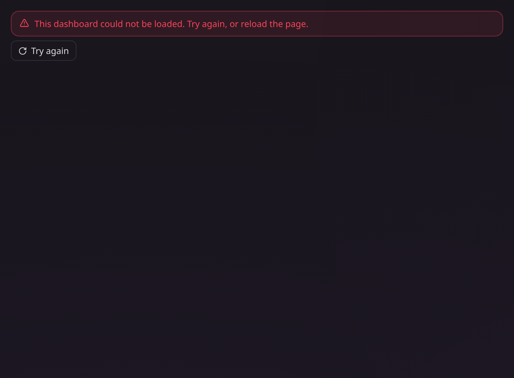

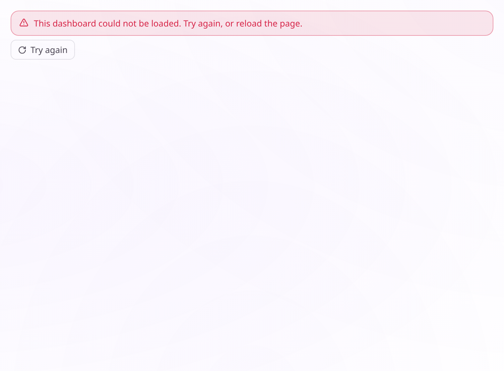

Some values did not resolve, so the page NAMES them rather than counting them, and
says the rest is current:

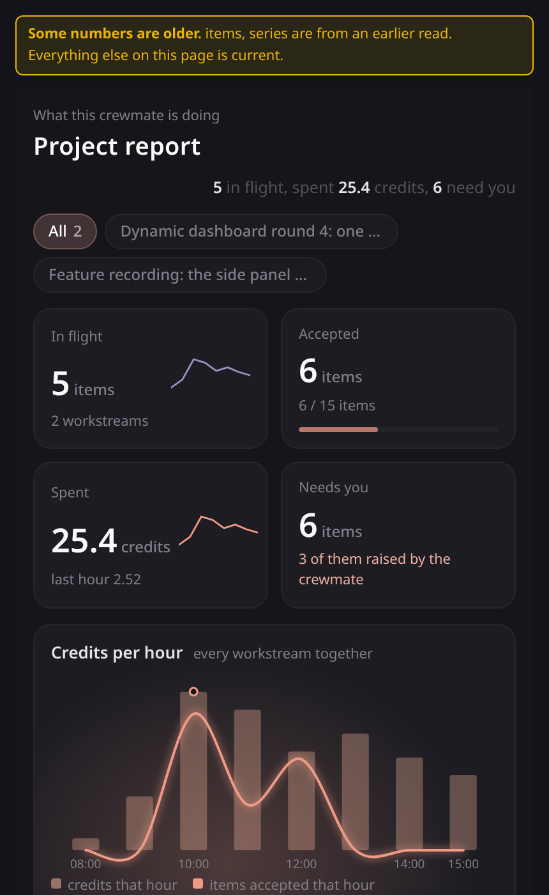

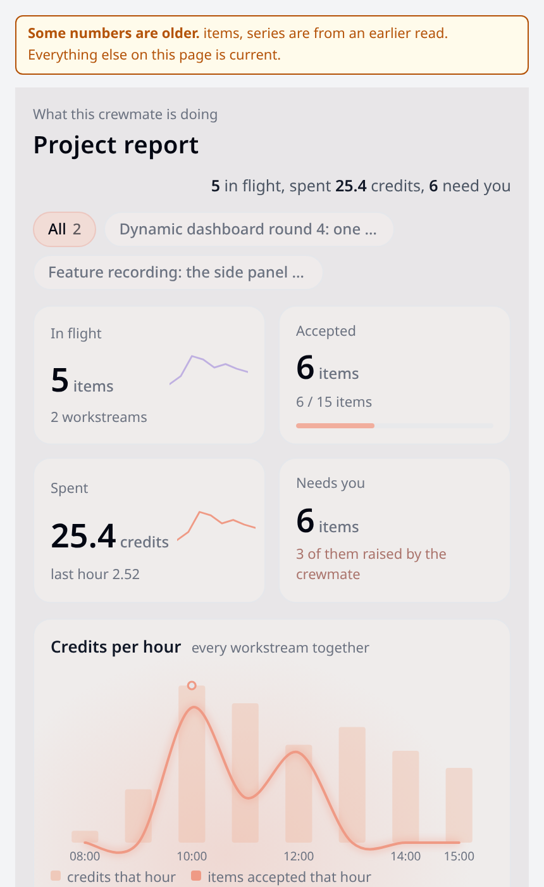

A newer page that failed to load while an older one was on screen, so the older
one is kept and the band says so:

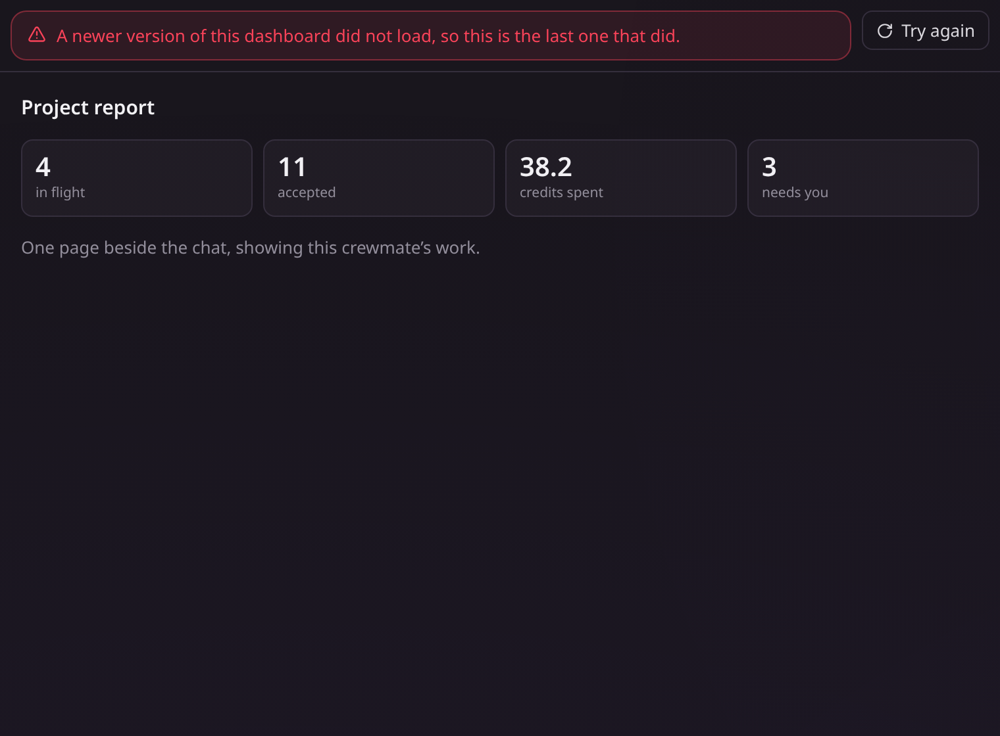

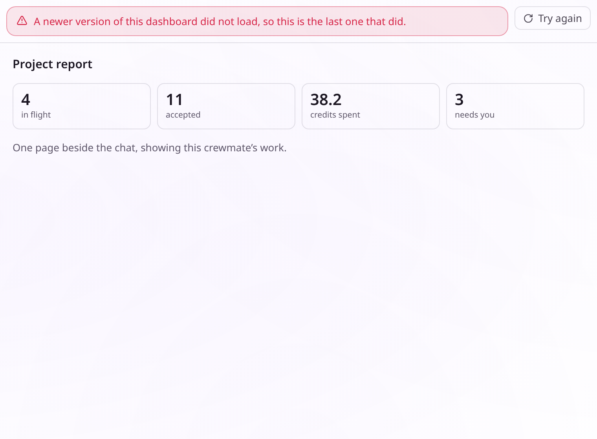

The document could not be minted into its sandbox at all, so there is no page to
draw under the band:

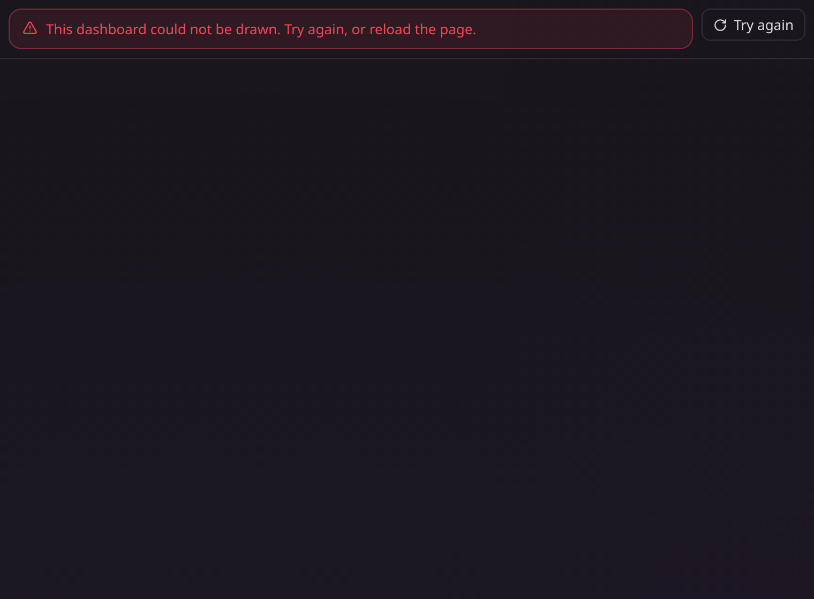

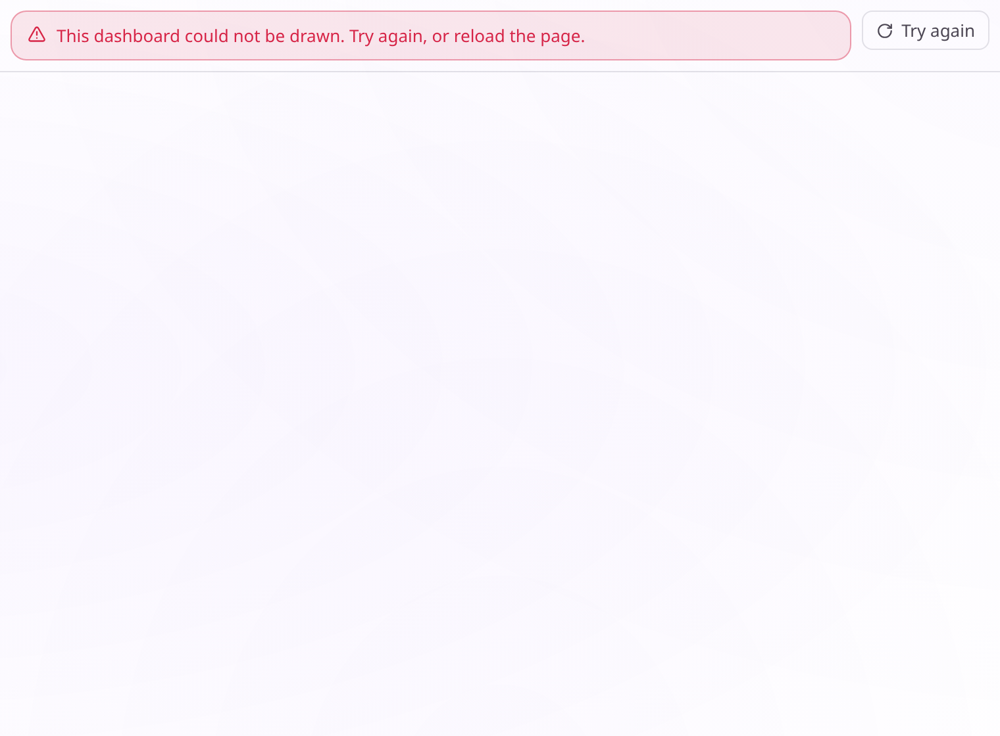

None of the five borrows the published-page frame's copy. That frame says
"published view", which this tab does not show, so each state has its own
`dashboard_*` string in all thirteen locales.

A newer page that failed to MINT while an older one was on screen, so the older
one stays and the band says it could not be redrawn:

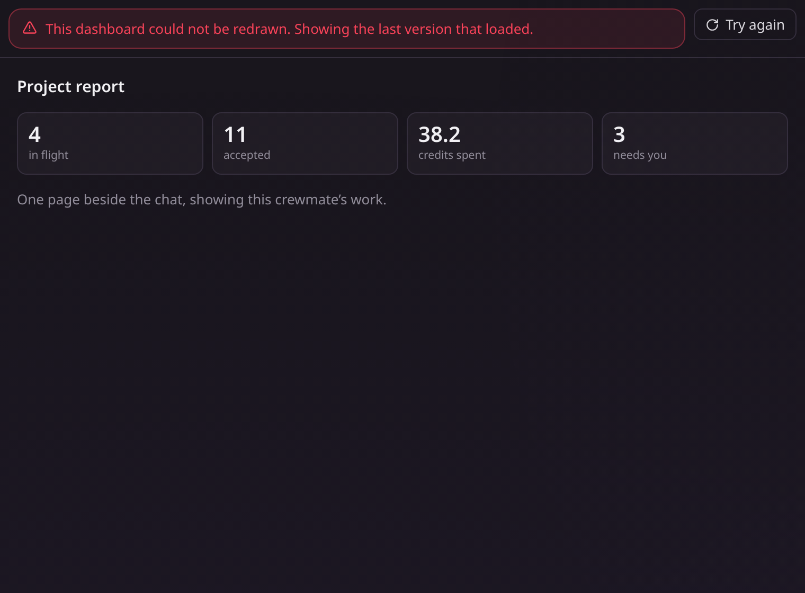

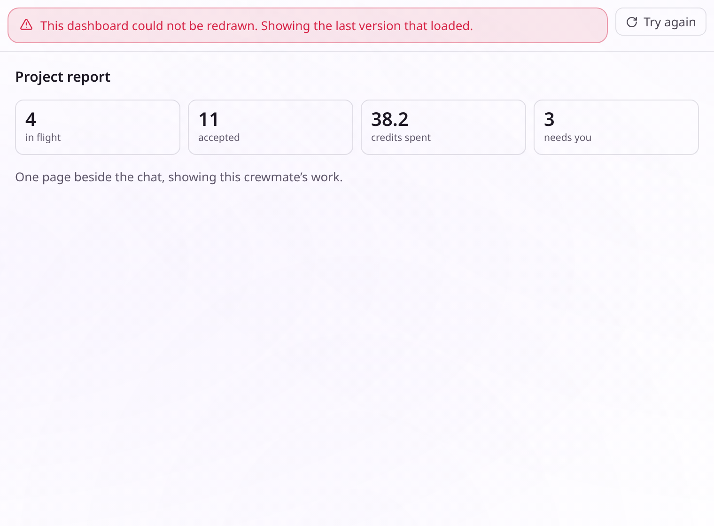

The read has answered and no document exists yet:

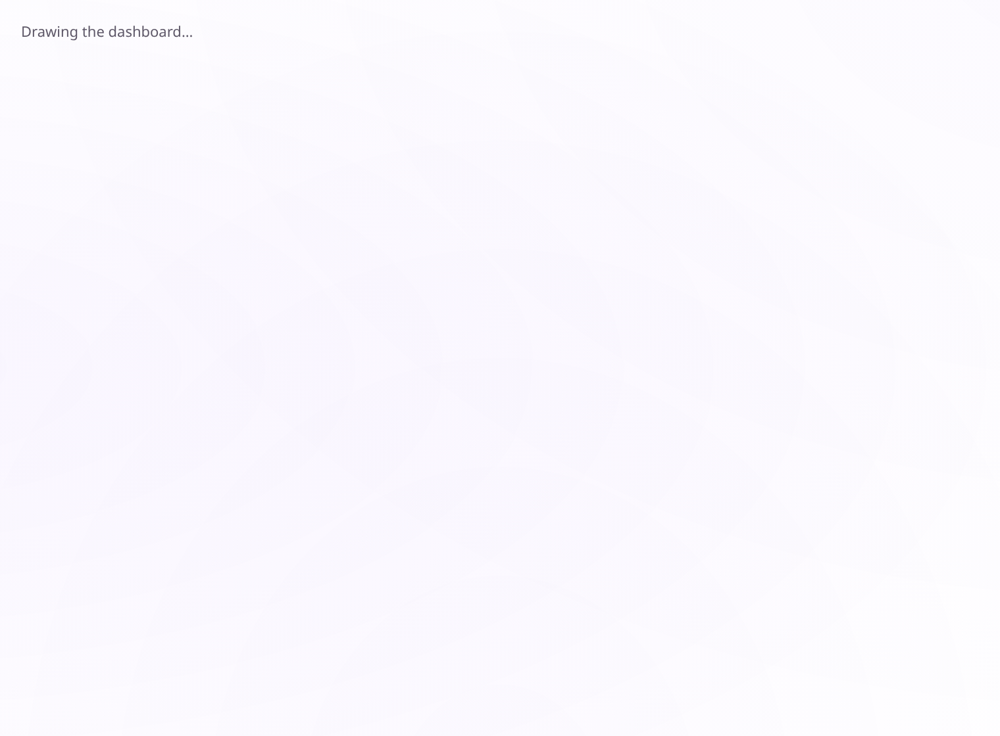

Every one of those states is the host's, so each is drawn here. The state a
brand-new crewmate opens on belongs to the page it is shown, and is evidenced
beside that page in the stacked change.
